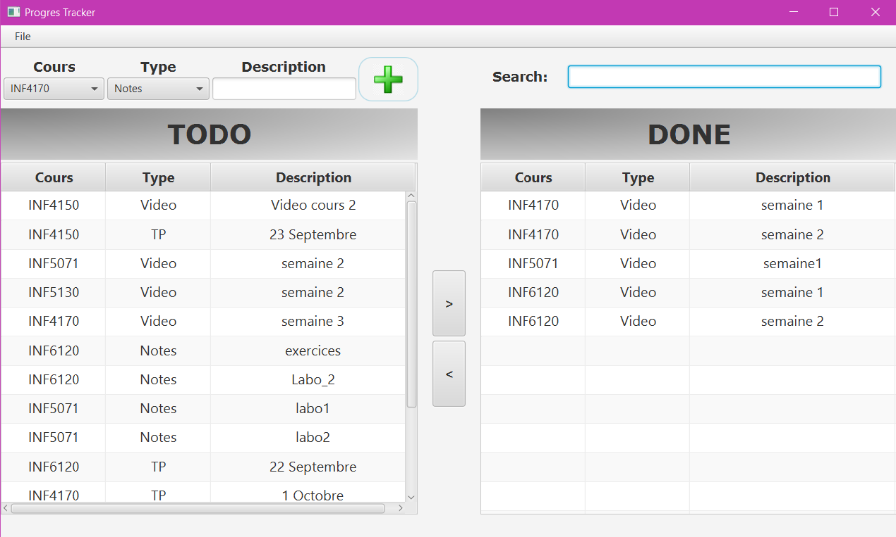
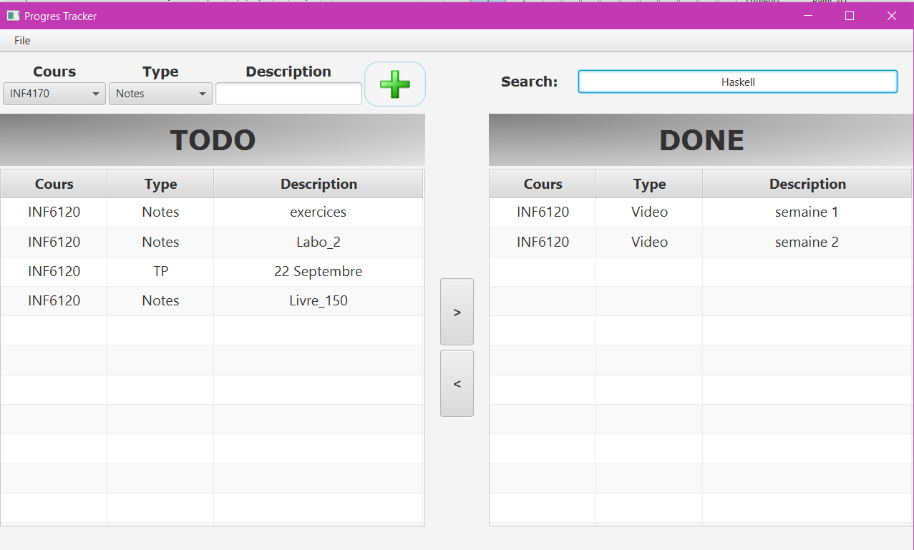

# Todo Application

## Principe
* Application créée avec JavaFX qui permet d'organiser les cours et les tâches qui leur sont reliées.

## VM
* La ligne suivante est nécessaire pour la compilation dans la VM:
  
  --module-path "C:\...\javafx-sdk-15\lib" --add-modules=javafx.controls,javafx.fxml
 
 ## Possibilitées
  * Ajouter un cours avec +
  * Filtrer
  * Sauvegarder
  * Transférer
  
 ## Screenshots
 
 
